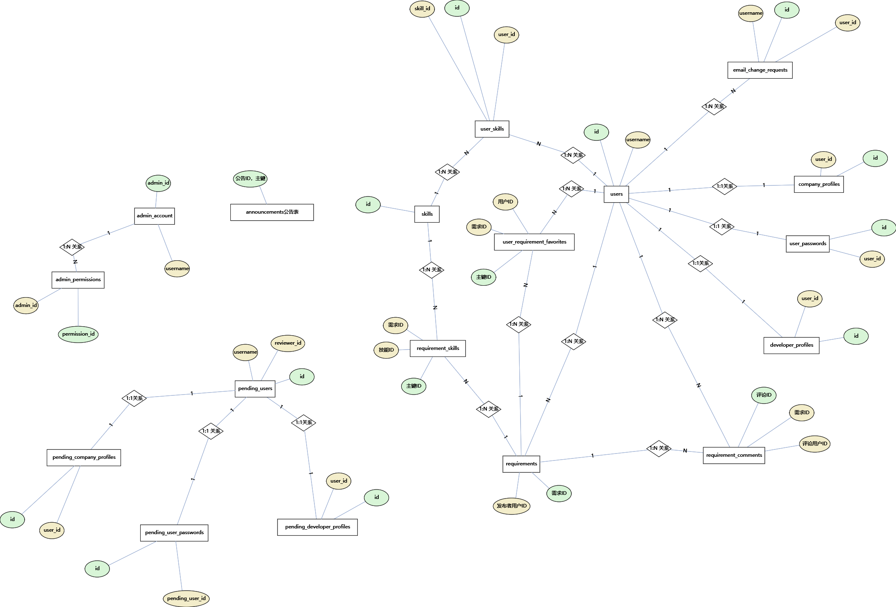
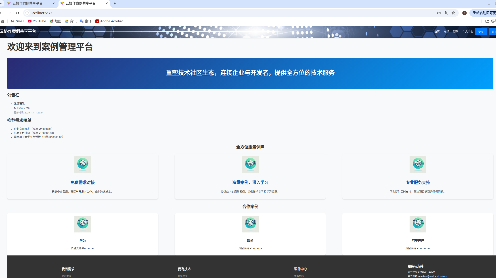

# 系统设计与架构

## 系统功能模块结构

### 1. 管理员管理模块

- **用户管理**：审核注册用户、删除用户、查看用户、审核用户邮箱变更申请、添加管理员、删除管理员。
- **技能标签管理**：添加、删除、编辑和修改技能标签。
- **公告管理**：发布、修改和删除公告。
- **案例统计管理**：按技能标签对需求进行统计和展示。

### 2. 用户个人中心管理模块

- **查看用户个人信息**：查看用户的个人信息以及关联的技能信息。
- **修改用户个人信息**：修改用户的个人信息以及关联的技能信息。
- **修改密码**：通过验证旧密码或邮箱验证来修改密码。
- **修改注册邮箱**：通过邮箱验证发起邮箱修改请求。
- **查看用户列表**：查看系统注册用户的列表，点击可以浏览用户的详细信息。
- **关注需求列表浏览**：浏览关注的需求，查看具体信息以及取消关注。
- **需求管理**：企业用户可以发布、修改和删除需求。

### 3. 需求管理模块

- **需求发布**：企业用户可以发布新的需求。
- **需求展示**：需求按照技能标签分类显示。
- **评论与协作**：用户可以对需求发表评论，企业用户可以对满意的评论发起协作邀请。
- **推荐系统**：根据用户技能、技能熟练度和关注的需求，生成加权推荐列表。
- **需求管理业务**：为企业用户提供需求管理功能。

### 4. 登录注册模块

- **用户注册**：用户通过邮箱注册，信息存储到临时表中，待管理员审核后迁移到正式表。
- **用户登录**：通过 SpringBoot 和 JWT 鉴权，生成包含用户名和用户类型的 Token，并根据权限控制访问。
- **忘记密码**：通过邮箱验证码重置密码。
- **修改密码**：用户可修改密码。
- **登出功能**：用户登出时删除 Redis 中存储的 Token。

### 5. 公告管理模块

- **公告管理**：管理员可在后台发布、修改和删除公告。
- **公告获取**：前端主页可以获取最新公告。

### 6. 技能标签管理模块

- 提供技能标签的增删改查业务。

---

## 系统架构

系统采用前后端分离的架构，主要包括以下组成部分：

### 1. 前端

- 使用 **Vue.js** 开发，模块化管理页面。
- 通过 **Pinia** 管理用户状态，存储 JWT Token 和用户信息。
- 通过 **Axios** 与后端进行 API 通信。

### 2. 后端

- 使用 **Spring Boot** 框架，采用分层架构设计（Controller → Service → Mapper）。
- 引入 **Spring Security** 和 **JWT** 进行用户鉴权与授权。
- 使用 **MyBatis Plus** 管理数据库交互，动态生成 SQL，对少量复杂操作手写 SQL。
- 使用 **Redis** 提供缓存支持（用户 Token、验证码、热点数据等）。

### 3. 数据库

- **MySQL**：用于持久化存储管理员信息、用户信息、需求、技能标签等数据。
- **Redis**：用于缓存数据（如需求推荐、技能标签）和存储临时数据（如验证码、临时注册用户信息）。

### 4. 推荐系统

- 结合用户技能熟练度和关注需求的技能权重，计算加权推荐分数。
- 使用缓存和计算结果返回推荐列表。

---

## 功能主要流程

### 1. 用户注册与登录流程

#### 注册流程

1. 用户填写注册信息（用户名、邮箱、密码等）。
2. 注册信息保存到临时注册表，等待管理员审核。
3. 管理员审核通过后，将用户信息迁移到正式表中。
4. 用户审核通过后可登录系统。

#### 登录流程

1. 用户提交用户名和密码。
2. 后端校验用户名和密码，并生成 JWT Token。
3. 前端存储 Token，通过 Token 鉴权访问其他功能。

---

### 2. 需求管理流程

#### 需求发布

1. 企业用户提交需求信息（标题、描述、预算、所需技能等）。
2. 系统保存需求信息，并将技能标签存储到关联表中。

#### 需求展示

1. 用户查看需求列表，可获得推荐需求列表或按技能标签分类筛选需求。
2. 点击需求查看详情页，包括需求具体信息和评论，并可关注需求。

#### 需求推荐

1. 系统根据用户技能及熟练度，对所需技能进行加权计算推荐分数。
2. 推荐列表按分数降序排序返回。

#### 需求邀请

企业用户在评论区可对满意的评论发起协作邀请，通知通过邮箱发送。

---

### 3. 用户个人管理流程

1. 用户浏览和修改自己的个人信息及技能标签。
2. 用户通过旧密码或邮箱验证码修改密码。
3. 用户通过邮箱验证码修改注册邮箱。
4. 用户查看关注的需求列表。
5. 企业用户管理需求的发布、修改和删除。

---

### 4. 管理员管理模块流程

#### 用户管理

1. 查看待审核用户列表。
2. 审核用户注册信息，决定是否批准。
3. 对违规用户进行封禁或删除操作。
4. 超级管理员可管理其他管理员。

#### 技能标签管理

1. 添加新的技能标签。
2. 编辑或删除已有技能标签。

#### 公告管理

1. 发布公告，所有用户可见。
2. 修改或删除公告。

---

## 数据库ER图

## 主界面

